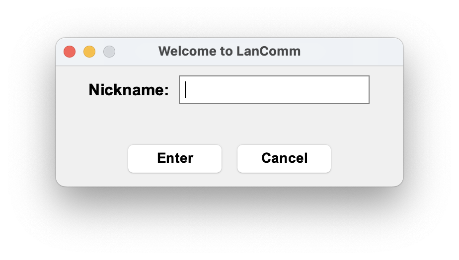
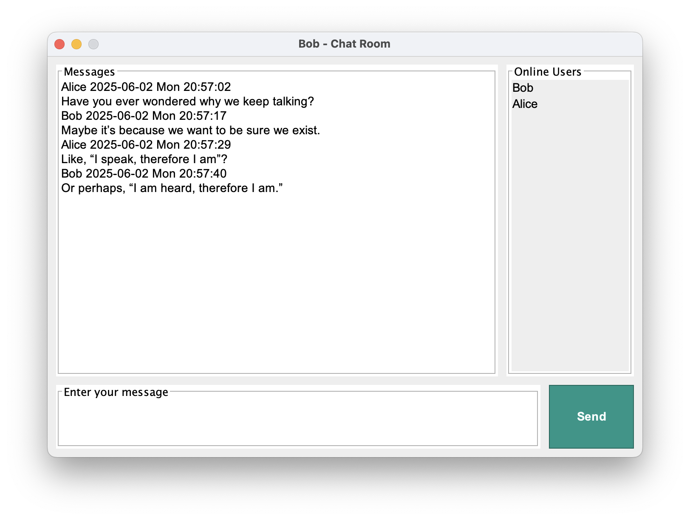

# LanComm

LanComm is a lightweight Java-based LAN chat system with a simple graphical interface. It allows users to communicate within the same local network — no internet required.

---

## 📁 Project Structure

```
LanComm/
├──  com.lancomm.client/     → Client-side logic
├──  com.lancomm.server/     → Server-side logic
├──  com.lancomm.shared/     → Shared constants and definitions
└──  com.lancomm.ui/         → Java Swing GUI
```

---

## ✨ Features

- Real-time chat over a local network
- Clean and intuitive graphical interface
- Multi-threaded server to handle multiple clients
- Fully offline – no internet needed

---

## 🖼 Interface Preview

**Login Window**  


**Chat Room Window**  


---

## 🚀 How to Use

1. Ensure all users are connected to the same local network (e.g., same Wi-Fi or router).

2. **Start the server**  
   Run the main class:
   ```
   com.lancomm.server.Server
   ```
   Only one server instance is required.

3. **Start a client**  
   Run the main class:
   ```
   com.lancomm.ui.App
   ```
   This will open the login window and connect to the server.

4. **To simulate additional users**  
   Just run `com.lancomm.ui.App` again in a new terminal or on another device.

---

## 📝 Notes

- The server must be started first, but only once.
- Clients can join and leave at any time.
- Useful in offline environments such as classrooms, workshops, and demos.

---

## 📄 License

MIT © 2025 hejunjiecao
